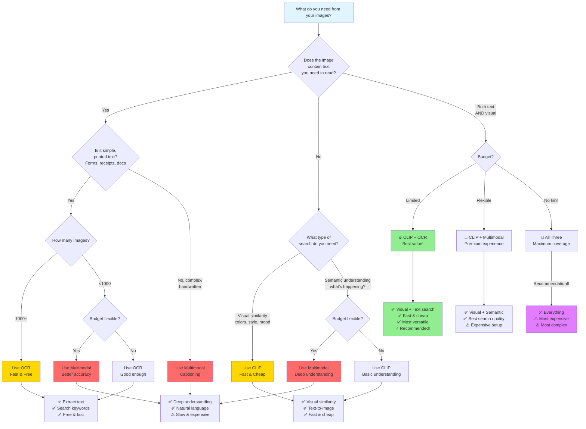

## Pick which image extracting method(s) you want to use

> `ultimate_image_extractor(img_path)`

```python
from rich import print
from llm_client import ultimate_image_extractor

img_path = "image.png"
results = ultimate_image_extractor(img_path)

print(type(results))  # <class 'dict'>
print(results)
# {'OCR': [0.123, 9.876, ...], 'multimodal': [0.123, 9.876, ...], 'CLIP': [0.123, 9.876, ...]}

```

**Description**:
By default puts through OCR, multimodal, and CLIP
it first extracts text with OCR and with extracted text converts to embebbedding.
same thing with multimodal captioning
CLIP doesnt output text so its normal embedding
Can also choose which methods you albeit verbose needing to do

**Parameters**:

- str1 `str`: can input either "OCR", "caption", or "CLIP"
- str2 `str`: can input either "OCR", "caption", or "CLIP"
- str3 `str`: can input either "OCR", "caption", or "CLIP"

**Returns** (dict):
if doing `ultimate_image_extractor(img_path)`

```python
{
    'OCR': {'text_results': 'Pic is ...', 'embed_results': [0.123, 9.876]},
    'caption': {'text_results': 'Pic is ...', 'embed_results': [0.123, 9.876]},
    'CLIP': {'text_results': None, 'embed_results': [0.123, 9.876]}
}
```

if doing `ultimate_image_extractor(img_path, "CLIP", "caption")`

```python
{
    "caption": {"text_results": "Pic is ...", "embed_results": [0.123, 9.876]},
    "CLIP": {"text_results": None, "embed_results": [0.123, 9.876]},
}
```

---

# Which to mode(s) to pick?

give quick tldr explaination here on how to think/decide

## Decision Flowchart


